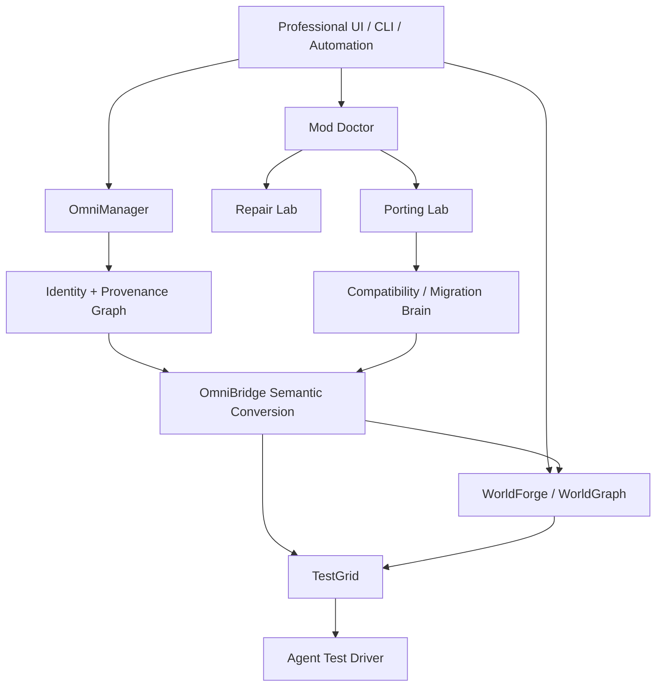

# 🏗️ Architecture

## Conceptual layers

## Architectural rules

1. **Identity before mutation.**
2. **Semantic intermediate representations over raw text substitution.**
3. **Versioned adapters.**
4. **Opaque passthrough for safe unknown data.**
5. **Transactions around destructive operations.**
6. **Confidence + provenance attached to generated results.**
7. **Runtime verification when behavior/rendering matters.**
8. **Plugins/adapters cannot silently weaken fidelity.**

## Performance direction

Rust/native acceleration, GPU compute, worker pools, content-addressed caches and copy-on-write runtimes are welcome only where benchmarks show real improvement without sacrificing correctness.
