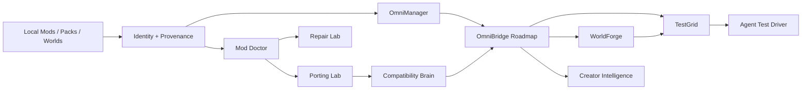

# 🧰 Minecraft Mod Vault

> [!IMPORTANT]
> **Minecraft Mod Vault is an evidence-first Minecraft mod manager, updater, repair laboratory, compatibility brain, and version-porting workbench for Java and Bedrock.** This wiki separates what is verified today from the larger **0.11.0 OmniBridge** roadmap so future ambition never gets confused with shipped capability.

## ✨ Start here

| I want to… | Go here |
|---|---|
| Understand the project in 3 minutes | **[Feature Overview](Feature-Overview)** |
| See what is verified vs planned | **[Release & Capability Status](Release-Status)** |
| Manage a mixed Java/Bedrock library | **[OmniManager](OmniManager)** |
| Compare Minecraft launchers and mod managers | **[Launchers & Mod Managers](Launchers-and-Managers)** |
| Diagnose or repair a broken mod | **[Repair Lab](Repair-Lab)** |
| Plan or execute a version/loader port | **[Porting Lab](Porting-Lab)** |
| Understand the 0.11.0 conversion vision | **[OmniBridge](OmniBridge)** |
| Follow mod authors and creator recommendations | **[Creator Intelligence](Creator-Intelligence)** |
| See the hyper-fast testing architecture | **[TestGrid](TestGrid)** |
| See full player-like agent testing | **[Agent Test Driver](Agent-Test-Driver)** |
| Edit/convert/repair/prune worlds | **[WorldForge](WorldForge)** |
| Regenerate old terrain without casually deleting builds | **[Pruning & Retrogen](WorldForge-Pruning-and-Retrogen)** |
| Compare WorldForge with Bedrock Editor | **[Bedrock Editor Parity](WorldForge-Bedrock-Editor)** |
| Compare WorldForge with Universal Minecraft Tool | **[UMT Parity](WorldForge-UMT-Parity)** |

## 🟢 What exists today

The repository contains verified **0.9.0 Repair/Porting** release evidence, including Porting Lab, Repair Lab, Compatibility Brain, reproducible build evidence, and Drive-verified artifacts. The current `main` README identifies the project as **0.10.0 OmniManager** and documents cross-store identity, native Bedrock package/world management, bulk update/recovery workflows, and a premium daily-management UI.

> [!NOTE]
> The wiki does **not** mark the 0.11.0 OmniBridge/WorldForge/TestGrid roadmap as shipped until the real implementation and runtime acceptance gates pass. See **[Release Status](Release-Status)**.

## 🌉 Where it is going

OmniBridge extends the existing product rather than replacing it. The roadmap adds deep Java ↔ Bedrock conversion, Minecraft-version/loader migration, CIT/resource-pack-to-mod workflows, standalone entity generation, Blockbench/Blender bridges, creator intelligence, disposable real-Minecraft testing, and **WorldForge**—a universal world converter/editor/repair/retrogen studio.

## 🧭 Design principles

| Principle | Meaning |
|---|---|
| **Evidence first** | Exact hashes, provider IDs, manifests, provenance and runtime proof beat guesses. |
| **Never silently destroy** | Unmapped content, inventories, block entities, world metadata and custom data must be preserved, surfaced or explicitly rejected. |
| **Local artifact is primary** | Storefronts are evidence attached to the thing you actually have installed—not the other way around. |
| **Java + Bedrock are peers** | Bedrock packs, worlds and templates are not second-class imports. |
| **Runtime truth wins** | A generated file or passing compile is not proof; real Minecraft verification is the final oracle when behavior matters. |
| **Additive evolution** | OmniBridge expands the existing product without using a new feature as an excuse to delete working functionality. |

## 🚦 Status legend

| Badge | Meaning |
|---|---|
| ✅ **Verified** | Release/runtime evidence is present and the workflow has documented proof. |
| 🟢 **Implemented / current** | Present in current project documentation or source, but not necessarily re-verified by this wiki refresh. |
| 🧪 **Experimental** | Real implementation exists but remains intentionally limited or unstable. |
| 🚧 **In Development** | Active implementation area; not safe to describe as complete. |
| 📋 **Planned** | Roadmap/TODO requirement, not a shipped claim. |
| ⚠️ **Evidence gap** | Documentation references capability/artifacts that need reconciliation in the current repository view. |

## 🔗 Project links

- **Repository:** https://github.com/Herbertofury/Minecraft-Mod-Vault
- **Wiki:** https://github.com/Herbertofury/Minecraft-Mod-Vault/wiki
- **Canonical project Drive folder:** https://drive.google.com/drive/folders/1nkX40V3f0psEQldm0WjAZH9o-gnAO-Ln
- **Roadmap:** [Roadmap](Roadmap)
- **Tool catalogue:** [Tool Catalogue](Tool-Catalogue)
- **Launcher reference:** [Launchers & Mod Managers](Launchers-and-Managers)

---

**New here?** Continue with **[Getting Started →](Getting-Started)**.
