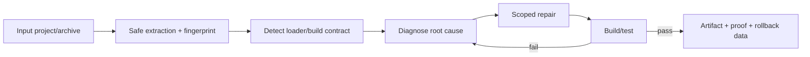

# 🩺 Repair Lab

> **Status:** ✅ Verified in the 0.9.0 release evidence.

Repair Lab is the source/project repair lane for broken or untrusted mod projects.

## Safety model

- treat source archives as hostile/untrusted input;
- defend against traversal, symlinks, duplicate paths, archive bombs and extraction escape;
- preserve immutable originals;
- detect the real loader/build contract;
- stage recognized migration edits instead of blindly rewriting everything;
- keep build/test/clean execution gated and explicit;
- hash outputs and preserve proof;
- support rollback.

## Repair loop

## See also

- [Porting Lab](Porting-Lab)
- [Compatibility Brain](Compatibility-Brain)
- [TestGrid](TestGrid)
