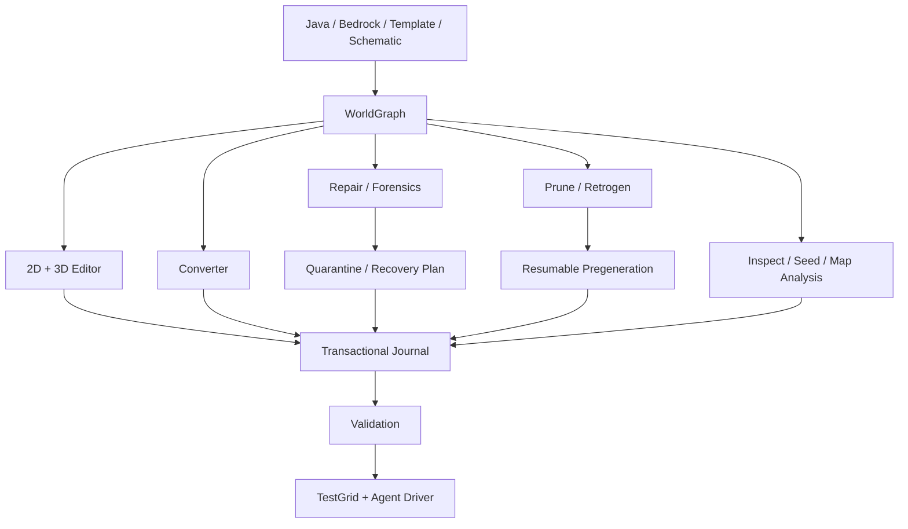

# 🌍 WorldForge

> [!IMPORTANT]
> **Status: 📋 0.11.0 roadmap.** WorldForge is the planned universal world converter, editor, repair, migration, pruning and retrogen studio inside OmniBridge.

## The ambition

Combine and surpass the strongest practical ideas from:

- Universal Minecraft Tool
- Chunker
- Amulet
- je2be
- Axiom
- WorldEdit / FAWE
- MCA Selector
- WorldPainter
- Minecraft Bedrock Editor
- Chunk Editor - MCA-Selector
- Chunky
- uNmINeD / BlueMap
- Seed Atlas / Cubiomes Viewer
- Neruina / World Corruption Fixer / Datapack Load Error Fix
- mc-world-migrator

—but prove superiority through fixtures and benchmarks, not feature-count marketing.

## Core systems

| System | Goal |
|---|---|
| **WorldGraph IR** | version-independent semantic representation + opaque passthrough for unknown data |
| **Java + Bedrock** | Anvil and LevelDB through versioned adapters |
| **Direct packages** | `.mcworld`, `.mctemplate`, `.mcproject` workflows |
| **2D + GPU 3D editor** | enormous worlds, LOD, slicers, overlays and direct semantic inspection |
| **World conversion** | terrain, biomes, items, block entities, entities, players, maps, POIs, structures, metadata |
| **Mod/add-on awareness** | migrate custom content alongside the world rather than deleting unknown IDs |
| **Repair & forensics** | corruption scanning, salvage, broken references, mixed-version diagnosis, ticking-object quarantine and source-vs-target recovery |
| **Transactional editing** | previews, snapshots, persistent undo, crash recovery, dry runs and quarantine instead of blind deletion |
| **Pruning & retrogen** | manual chunk pruning plus player-build-aware regeneration and seam repair |
| **Pregeneration scheduler** | resumable, throttled chunk generation/retrogen with player/load-aware pause and recovery |
| **Inspection & analysis** | streamed 2D/3D maps, version/age/error heatmaps, seed/structure search and world-diff overlays |
| **TestGrid integration** | launch source/target worlds and verify behavior in real Minecraft |

## 2026 world-tooling gems now informing the roadmap

| Project | WorldForge lesson |
|---|---|
| **[Chunk Editor - MCA-Selector](https://modrinth.com/mod/mca-selector)** | In-game region-file inspection with LOD, custom dimensions and coordinated region/entity/POI deletion. |
| **[Misanthropy's World Corruption Fixer](https://modrinth.com/mod/world-corruption-fixer)** | Guided backup-first recovery for worlds blocked by stale removed-mod dimension/worldgen metadata. |
| **[Datapack Load Error Fix](https://modrinth.com/mod/datapack-load-error-fix)** | Detect and clean invalid custom dimension/entity/block references rather than leaving a save unloadable. |
| **[mc-world-migrator](https://github.com/hkniberg/mc-world-migrator)** | Source-vs-target semantic repair, UUID/position matching, dry runs, resumability, manifests and idempotent fixers. |
| **[Neruina](https://modrinth.com/mod/neruina)** | Quarantine ticking entities/block entities instead of allowing one bad object to brick an entire save. |
| **[YapiFix](https://modrinth.com/mod/yapifix)** | Diagnose and resolve deterministic worldgen feature-order cycles after biome/worldgen modifications. |
| **[Chunky](https://modrinth.com/plugin/chunky)** + **[Chunky Extension](https://modrinth.com/mod/chunky-extension)** | Mature pregeneration plus pause/resume/load-aware scheduling for long-running world operations. |
| **[Regionerator](https://github.com/Jikoo/Regionerator)** + **[ChunkCleaner](https://github.com/zeroBzeroT/ChunkCleaner)** | Gradual maintenance, dry-run selection and quarantine-before-delete patterns for unused chunks. |
| **[uNmINeD](https://unmined.net/)** + **[BlueMap](https://github.com/BlueMap-Minecraft/BlueMap)** | Fast streamed 2D/3D inspection across huge or modded worlds. |
| **[Seed Atlas](https://github.com/DUzzL/Seed-Atlas)** | Multithreaded local biome/structure search, density analysis, filters and resumable large-area scans. |
| **[WorldBinder](https://modrinth.com/mod/worldbinder)** | Authorized client-observed world preservation with capture queues and crash/disconnect recovery; never imply access to server data the client was never sent. |

## Safety/quality laws learned from the ecosystem

1. **Diagnose before writing.** Every repair path starts read-only and classifies what is actually wrong.
2. **Dry-run destructive work.** Show affected dimensions, regions, chunks, entities, keys/files and confidence before commit.
3. **Quarantine beats deletion.** Move/copy suspect data aside with a journal whenever possible.
4. **Resume safely.** Region-scale repair/conversion/pregen must be idempotent and interruption-safe.
5. **Treat chunk layers coherently.** Java terrain/entity/POI region data and Bedrock LevelDB key families must stay logically synchronized.
6. **Heuristics are not truth.** `InhabitedTime`, block palettes and build-detection signals are evidence only; explicit user protection overrides them.
7. **Original saves are evidence.** When a pre-upgrade/pre-removal save exists, source-vs-target semantic comparison should beat guessed reconstruction.

## Deep dives

- [Repair & Forensics](WorldForge-Repair-and-Forensics)
- [Pruning & Retrogen](WorldForge-Pruning-and-Retrogen)
- [Bedrock Editor Parity](WorldForge-Bedrock-Editor)
- [Universal Minecraft Tool Parity](WorldForge-UMT-Parity)
- [Validation & Fidelity](Validation-and-Fidelity)
- [2026 world-tooling research ledger](https://github.com/Herbertofury/Minecraft-Mod-Vault/blob/main/research/worldforge-tooling-landscape-2026.md)
