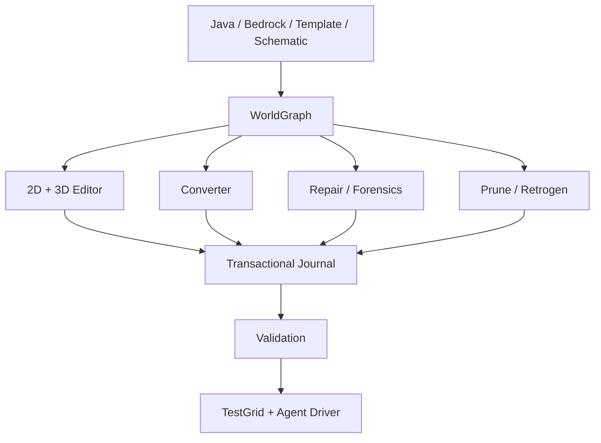

# 🌍 WorldForge

> [!IMPORTANT]
> **Status: 📋 0.11.0 roadmap.** WorldForge is the planned universal world converter, editor, repair, migration, pruning and retrogen studio inside OmniBridge.

## The ambition

Combine and surpass the strongest practical ideas from:

- Universal Minecraft Tool
- Chunker
- Amulet
- je2be
- Axiom
- WorldEdit / FAWE
- MCA Selector
- WorldPainter
- Minecraft Bedrock Editor

—but prove superiority through fixtures and benchmarks, not feature-count marketing.

## Core systems

| System | Goal |
|---|---|
| **WorldGraph IR** | version-independent semantic representation + opaque passthrough for unknown data |
| **Java + Bedrock** | Anvil and LevelDB through versioned adapters |
| **Direct packages** | `.mcworld`, `.mctemplate`, `.mcproject` workflows |
| **2D + GPU 3D editor** | enormous worlds, LOD, slicers, overlays and direct semantic inspection |
| **World conversion** | terrain, biomes, items, block entities, entities, players, maps, POIs, structures, metadata |
| **Mod/add-on awareness** | migrate custom content alongside the world rather than deleting unknown IDs |
| **Repair & forensics** | corruption scanning, salvage, broken references, mixed-version diagnosis |
| **Transactional editing** | previews, snapshots, persistent undo, crash recovery, dry runs |
| **Pruning & retrogen** | manual chunk pruning plus player-build-aware regeneration and seam repair |
| **TestGrid integration** | launch source/target worlds and verify behavior in real Minecraft |

## Deep dives

- [Pruning & Retrogen](WorldForge-Pruning-and-Retrogen)
- [Bedrock Editor Parity](WorldForge-Bedrock-Editor)
- [Universal Minecraft Tool Parity](WorldForge-UMT-Parity)
- [Validation & Fidelity](Validation-and-Fidelity)
